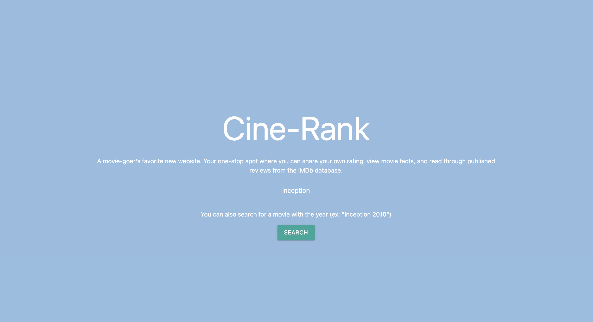
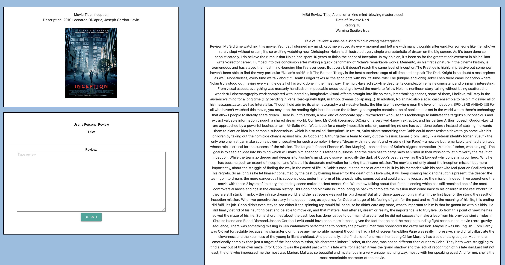

# Cinerank App
Created by Lilly Ruiz and Kristina Dukes

## Description
Cinerank is a new movie information and review application that allows users to search for a recently watched movie and view accurate information about the movie, the movie poster and other pertinent information directly from the IMDb database. On the same page, users can also submit their own review on their watch experience and submit it for the review team to follow up. The response of the user can be submitted and stored via locally on the computer.  

## Usage
To search for a movie, locate the textbox under the main title of the page to type the name of the movie you would like to view. The user can also provide the year that the movie was released for a more accurate search. When the user clicks on the green search button, the page will load and contain a row of 3 boxes that contain the information of the movie, user's own review input, and a published IMDb review pulled from the IMDb website.

## Credits/Technologies Used 
Materialize CSS 
https://materializecss.com/

IMDb Search Movies API
https://imdb-api.com/api/#Search-header

IMDb Reviews API
https://imdb-api.com/api/#Reviews-header

### Screenshot of Webpage 

### Link to Deloyed Webpage
